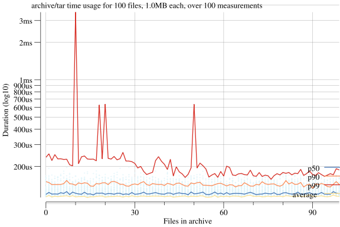

I'm not yet ready to publicize this package, since I haven't had it reviewed yet. Suggestions are welcome in form of PRs or issues, or just ping me on IRC/Slack/Twitter.

# benchkit

Package benchkit is the lightweight, feather touch, benchmarking kit.
In comparison to the standard pprof utilities, this package is meant to
help generating graphs and other artifacts.

## Quick!

Benchmark your code!

```go
memkit, results := benchkit.Memory(n)

memkit.Setup()
files := GenTarFiles(n, size)
memkit.Starting()
each := memkit.Each()
tarw := tar.NewWriter(buf)
for i, file := range files {
    each.Before(i)
    _ = tarw.WriteHeader(file.TarHeader())
    _, _ = tarw.Write(file.Data())
    each.After(i)
}
_ = tarw.Close()

memkit.Teardown()
```

Plot your benchmarks with `benchkit/benchplot`!

```go
// Plot the results !
p, _ := benchplot.PlotMemory(
    fmt.Sprintf("archive/tar memory usage for %n files of %s", n, humanize.Bytes(uint64(size))),
    "files in archive",
    memResults,
)
_ = p.Save(8, 6, "tar_benchplot.png")
```


```go
// Plot the results !
p, _ := benchplot.PlotTime(
    fmt.Sprintf("archive/tar duration per file, for %n files of %s", n, humanize.Bytes(uint64(size))),
    "files in archive",
    timeResults,
)
_ = p.Save(8, 6, "tar_benchplot.png")
```




## Usage

Get a benchmark kit:

```go
bench, result := benchkit.Memory(n)
```

A benchmark kit consists of 4 methods:

* `Setup`: call before doing any benchmark allocation.
* `Starting`: call once your benchmark data is ready, and you're about to start the work you want to benchmark.
* `Each`: gives an object that tracks each step of your work.
* `Teardown`: call once your benchmark is done.

```go
bench, result := benchkit.Memory(n)
bench.Setup()
// create benchmark data
bench.Starting()
doBenchmark(bench.Each())
bench.Teardown()
```

Inside your benchmark, you will use the `BenchEach` object. This object
consists of 2 methods:

* `Before(i int)` : call it _before_ starting an atomic part of work.
* `After(i int)` : call it _after_ finishing an atomic part of work.

In both case, you must ensure that `0 <= i < n`, or you will panic.

```
func doBenchmark(each BenchEach) {
    for i, job := range thingsToDoManyTimes {
        each.Before(i)
        job()
        each.After(i)
    }
}
```

In the example above, you could use `defer each.After(i)`, however `defer` has some
overhead and thus, will reduce the precision of your benchmark results.

The `result` object given with your `bench` object will not be
populated before your call to `Teardown`.:

```go
bench, result := MemBenchKit(n)
// don't use `result`
bench.Teardown()
// now you can use `result`
```

Using `result` before `Teardown` will result in:

> `panic: runtime error: invalid memory address or nil pointer dereference`

So don't do that. =)

## Kits

### Memory

Collects memory allocation during the benchmark, using `runtime.ReadMemStats`.

## Plot

Have a look at [`benchplot`](benchplot/)! Quickly plot memory stats!

```go
// Plot the results !
p, _ := benchplot.PlotMemory(
    fmt.Sprintf("archive/tar memory usage for %n files of %s", n, humanize.Bytes(uint64(size))),
    "files in archive",
    results,
)
_ = p.Save(8, 6, "tar_benchplot.png")
```

## More kits

So far, I've only needed the memory benchkit. Remember, work is freedom.
Be a freemind and kindly submit new kits!

## License

MIT licensed.
