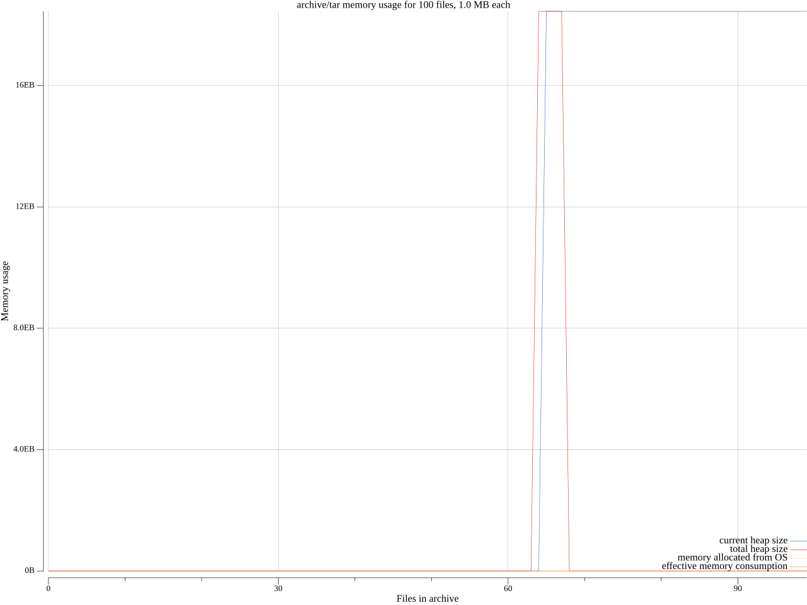

# benchplot

Plotinum helpers for `benchkit`.

# PlotMemory

The example:

```go
files := GenTarFiles(n, size)

results := benchkit.Bench(benchkit.Memory(n)).Each(func(each benchkit.BenchEach) {
    for j, file := range files {
        each.Before(j)
        // file -> tar
        each.After(j)
    }
}).(*benchkit.MemResult)

p, _ := PlotMemory(
    fmt.Sprintf("archive/tar memory usage for %d files, %s each", n, humanize.Bytes(uint64(size))),
    "Files in archive",
    results,
)
_ = p.Save(6, 4, "tar_memplot.svg")
```

Yields the graph:



# PlotTime

Similarly:

```go
files := GenTarFiles(n, size)

results := benchkit.Bench(benchkit.Time(n, times)).Each(func(each benchkit.BenchEach) {
    for repeat := 0; repeat < times; repeat++ {
        // reset
        for j, file := range files {
            each.Before(j)
            // file -> tar
            each.After(j)
        }
    }

}).(*benchkit.TimeResult)

p, _ := PlotTime(
    fmt.Sprintf("archive/tar time usage for %d files, %s each, over %d measurements", n, humanize.Bytes(uint64(size)), times),
    "Files in archive",
    results,
)
_ = p.Save(6, 4, "tar_timeplot.svg")
```

Yields the graph:


